#                                   C/C++/嵌入式 笔记 

[TOC]

# 一、关键字

## 1.1 new/delete

- new和delete是C++操作符。
- new可以调用对象的构造函数，delete可以调用对象的析构函数。
- new可以初始化，返回值是指针；new和delete配套使用，new [] 和delete [] 配套使用。
-  int * p = new int (10);    在堆区创建了一个数，初始化为10。
- int *arr = new int [10]；在堆区创建了一个数组，初始化为10个（数组元素默认值不为0，需要赋值）。
- new/delete  的底层调用了malloc/free。

## 1.2 malloc/free

- malloc/free是C/C++均可用的函数。在C语言中需要头文件 <stdlib.h>和<malloc.h> 。
- malloc仅分配空间，不进行初始化，返回值是指针：int * p = (int *) malloc (sizeof(int) * 100);（最后一个*表示乘法）。
- malloc和free配套使用，两者是函数，不是操作符，因此不调用构造和析构函数。

## 1.3 const

### 1.3.1 C

- 可通过指针修改值，仅建议。

### 1.3.2 C++

- 类成员函数后: 这个函数不会对这个类对象的数据成员（准确地说是非静态数据成员）作任何改变； const函数内，只能调用const函数。即==防止对形参误操作==,例如下图中a=100就是错误的。

  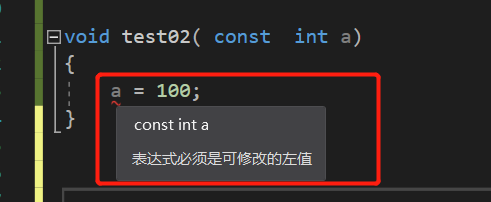

- 类成员函数前: 返回值是一个常量，不能修改。

- const对象：只能访问const和static修饰。

- const变量:   编译器会将常量优化，放到符号表，取值会从表中直接获取，而不是去内存。通过指针修改值后，值不变。添加关键字volatile（const和volatile可以同时使用），可以防止编译器优化，从内存取值。通过指针修改值后，值会变。

- 指针常量：int * const p = & a; 指针的指向不可更改，指针指向的值可改。（记法：const翻译为常量，*翻译为指针，按顺序读即可）

- 常量指针：const int * p = & a; 指针的指向可以修改，指向的值不可更改。

### 1.3.3 const/#define

- 区别：

  （1）对于修饰常量，const定义的常数是变量，带类型，#define不带类型；

  （2）对于起作用的阶段，const在编译和运行的时候起作用，#define在编译的预处理时起作用；

  （3）对于检查有无，const要进行类型检查和判断可避免低级错误，#define不进行类型检查；

  （4）对于占用空间的位置，const占用数据段空间，#define预处理后，占用代码段空间；

  （5）对于调试，const常量可以调试，#define不可以，因为编译阶段已经被替换掉了；

  （6）对于重定义，const不能重定义，#define可以通过#under取消某个符号的定义，再重新定义。

## 1.4 static

- 函数体内： 修饰的局部变量作用范围为该函数体，**在内存只被分配一次，下次调用的时候维持了上次的值**。

- **源文件**全局：修饰的全局变量或函数，范围限制在声明它的模块内，**不能被extern找到**。

- 类中修饰成员变量: 表示该变量属于整个类所有，对类的所有对象只有一份拷贝。 

- 类中修饰成员函数: 表示该函数属于整个类所有，不接受this指针，只能访问类中的static成员变量。 

- 全局静态存储区：BSS（全局未初始化区），DATA（全局初始化区）。

- 延长变量生存周期，对于如下程序，a在test01执行结束后就释放了，但是b存在全局区，main函数执行后才会被释放。

  ​       void test01()
  ​       {
  ​       	int   a   =   10;
  ​       	static  int  b  =  100;
  ​       }

## 1.5 volatile

- C/C++中的关键字（翻译为易变的）。
- 避免优化、强制内存读取的顺序。
- 没有线程同步的语义。

## 1.6 extern

- 使用include将另一个文件全部包含进去可以引用另一个文件中的变量，但是这样做的结果就是，被包含的文件中的所有的变量和方法都可以被这个文件使用，这样就变得不安全。如果只是希望一个文件使用另一个文件中的某个变量还是使用extern关键字更好。 
- 源文件中的全局变量与函数，默认都能被extern找到。

## 1.7 override

-  配合 **virtual** 关键字使用；修饰子类 **override** 函数。 


## 1.8 include

- **#include<> :**  表示只从从标准库文件目录下搜索，对于标准库文件搜索效率快。
- **#include" " :**  表示首先从用户工作目录下开始搜索，对于自定义文件搜索比较快，然后搜索标准库。 

## 1.9  typedef/#define

- typedef是关键字，有类型检查的功能，有作用域；在作用域内个一个已经存在的类型起一个别名，简化程序；例如：  typedef int INT;  结尾有分号。
- #define 是预处理指令，预处理时不做检查，字符机械替换；如#define    ADD（a,b）    a+b，结尾无分号。

## 1.10 class/struct

- class内容是默认private的，struct内容都是public的。

## 1.11 inline

- 内联函数，是一种更安全的宏；解决一些频繁调用的函数大量消耗**栈**空间的问题。

## 1.12 cin

- while (  cin>>in)  {   }  结束输入的操作： 输入结束后，按回车，在新行输入Ctrl+z并回车 。

## 1.13 continue/break

- **break :** 只能在switch语句和循环体里使用，跳出本**层**循环。
- **continue ：**结束本**次**循环，进行本层循环的下一次循环。

## 1.14 friend

- friend修饰的函数，可以访问私有成员。

  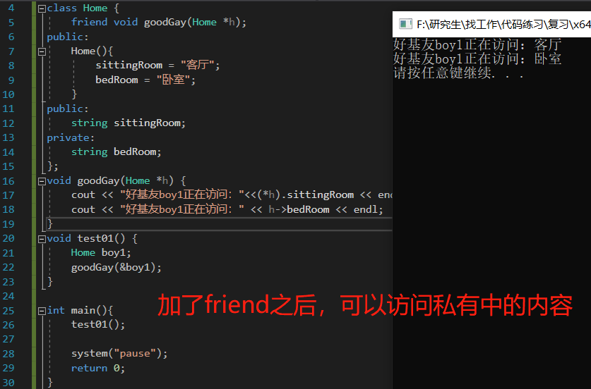


# 二、面向对象

## 2.1 虚函数

- 动态绑定地址，实现条件：

  （1）要有继承；

  （2）子类重写父类的虚函数，子类的函数可以不加virtual关键字；

  （3）父类的指针或引用指向子类的对象。

- 子类继承父类的地址，父类函数若用virtual修饰后，子类的虚函数指针会绑定自己的地址，从而实现重写父类。

## 2.2 纯虚函数

- 多态中，通常父类中虚函数的实现是毫无意义的，主要是调用子类重写的内容，因此可以将虚函数写为纯虚函数。

- 语法： virtual   返回值类型   函数名   (参数列表)   =   0；当类中有了纯虚函数，这个类也成为抽象类。

- 抽象类特点：

  （1）无法实例化对象；

  （2）子类必须重写抽象类中的纯虚函数，否则也属于抽象类。

## 2.3 构造/析构函数

### 2.3.1 构造和析构定义

- 构造函数：主要作用于在创建对象时为对象的成员属性赋值，构造函数由编译器自动调用，无需手动调用，但可以重写（初始化操作）。

  #include< iostream>
  using namespace std;
  #include< string>

  class Person {
  public:
  	//构造函数
  	Person() {
  		cout << "Person的无参构造函数" << endl;
  	}
  	//带参构造函数
  	Person(int a){
  		age = a;
  		cout << "Person的有参构造函数" << endl;
  	}
  	//拷贝构造函数
  	Person(const Person &p){
  		age = p.age;  //将传入的p的身上的所有属性，拷贝到自己身上
  		cout << "Person的拷贝构造函数" << endl;
  	}

  	~Person(){
  		cout << "Person的析构函数" << endl;
  	}
  	int age;

  };
  //调用
  void test01(){
  	//1 括号法
  	Person p1;        //栈上的数据，test01执行之后就会释放这个数据，
  					  //如果Person p1写在main里面。则main运行结束后调用析构
  	Person p2(10);    //调用有参构造
  	Person p3(p2);    //调用拷贝构造
  	cout << "p2的年龄为： " << p2.age << endl;
  	cout << "p3的年龄为： " << p3.age << endl;
  	//2 显示法
  	Person p1;                  //无参构造
  	Person p2 = Person(10);     //有参构造
  	Person p3 = Person(p2);     //拷贝构造
  	//注意：
  	Person(10);   //匿名对象，构造后立刻析构，不等test01执行完就析构
  	//3 隐式转换法
  	Person p4 = 10;

  }                   

  int main(){
  	test01();
  	system("pause");
  	return 0;
  }

- 析构函数：主要用于对象销毁前系统自动调用（结束自动调用）。连续的几个对象，析构时遵循先入后出的顺序，后构造的对象先析构。

### 2.3.2 继承中的构造和析构顺序

- 继承时，白发人送黑发人。

  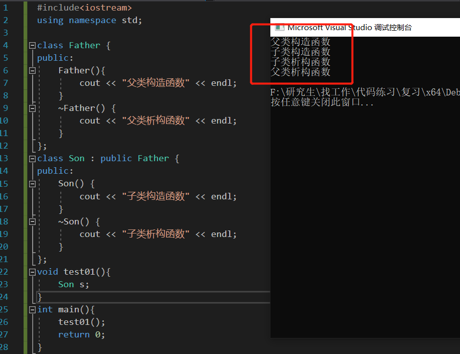

## 2.4 深/浅拷贝

- 浅拷贝：简单的赋值拷贝操作。

  （1）如果利用编译器提供的拷贝构造函数，会做浅拷贝操作，如Person p2(p1);

  （2）浅拷贝的问题：**堆区内存重复释放**；若在堆区创建一个变量，然后拷贝一次后，有了两个对象：原对象和拷贝对象，两者都会释放堆区内存，程序会崩。

- 深拷贝：==在堆区重新申请空间，进行拷贝操作==，使得两个对象的数据指向不同的指针，没有交集，解决浅拷贝的问题。

  （1）自己写拷贝构造函数：

  Person (const  Person  & p){

  ​	m_A  =  new  int  (*p.m_A);

  }

  （2）如果堆区有数据，需要在析构函数释放：

  ~Person(){

  ​	     if(data  !=  NULL){

  ​            delete  data;

  ​            data = NULL;        //初始化一下data，防止野指针出现

  ​     }

  }

## 2.5 this指针

- 作用：

  （1）解决名称冲突 ;

  （2）返回对象本身用  return   * this ,可以进行链式操作；

- C++中成员变量和成员函数是分开存储的，每一个非静态成员函数只会诞生一份函数实例，也就是说多个同类型的对象会共用一块代码，**this指针是区分哪个对象调用自己**的问题。

- **this指针指向被调用的成员函数所属的对象。**

  class Person {

  public:
  	Person(int age)
  	{
  		this->age = age;    // **this指向对象p1，==指向调用Person(int  age)的对象==。**
  	}
  	int age;
  };

  void test01()
  {
  	Person **p1**(18);
  	cout << "Person 的年龄为：" << p1.age << endl;
  }

## 2.6 继承

- 公有继承、保护继承、私有继承。

  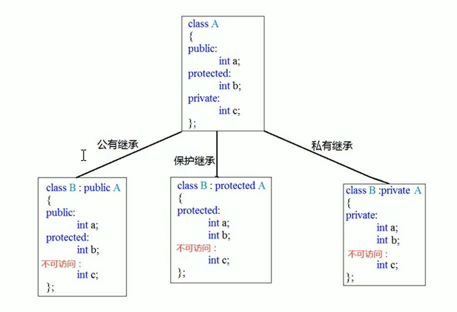

- 访问权限：

  （1）**public:**          类内可以访问，类外可以访问；

  （2）**protected:**   类内可以访问，类外不可以访问，继承时儿子可以访问父类的保护内容；

  （3）**private:**        类内可以访问，类外不可以访问，继承时儿子不可以访问父类的私有内容，但是friend可以访问私有内容。

## 2.7 运算符重载

- 对已有的运算符，赋予另一种功能，使其实现新的功能。

-   “ + ” 运算符重载

  （1）成员函数重载：本质：Person  p3  =  p1.operator+ (p2);

  ```c++
  Person operator+ (Person &p) {
  	Person temp;
  	temp.m_A = this->m_A + p.m_A;
  	temp.m_B = this->m_B + p.m_B;
  	return temp;
  }
  ```
  （2）全局函数重载：本质：Person  p3  =  operator+ (p1  +  p2);

  Person operator+ (Person &p1,Person &p2) {
  	Person temp;
  	temp.m_A = p1.m_A + p2.m_A;
  	temp.m_B = p1.m_B + p2.m_B;
  	return temp;
  }

  （3）不同属性数据相加

  Person  operator+ (Person  &p1 , int  num){

  ​	Person  temp;

     temp.m_A =  p1.m_A  +  num;    // 实现了类中的元素和类外的int类型的数据相加

  }

  

# 三、指针和引用

## 3.1 区别

- 指针有存储空间，引用没有，引用是起别名，和原对象共地址。

- 引用语法：int &b = a;（给a起了一个别名，叫做b，如果b的数值改变，a也跟着改），理解为创建快捷方式。

- ==引用必须初始化，初始化后不可以改变==。

- 引用的本质是==指针常量==，而指针常量是指针的指向不可更改。

  如果int  a  =  10;  int  & b  =  a;

  对于int  & b  =  a;来说，编译器会将其转换为：int *  const  ref  =  & a;

## 3.2 引用的用途

### 3.2.1 引用做函数参数

- 形参可以修饰实参，因为形参是实参的引用，即起别名，形参怎么变，实参就怎么变。

### 3.2.2 引用做函数返回值

- 如果一个函数的返回值是引用，那么这个函数可以作为左值。

  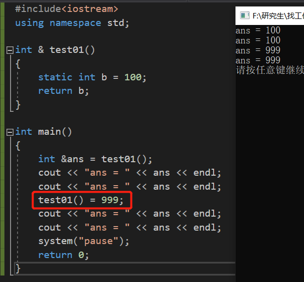

- 不要返回局部变量的引用。

  上图中，如果不用static延长b的生命周期，则第二个cout会输出乱码，因为test01运行结束后会释放掉局部变量，而static将b修饰为全局变量，只有在main函数结束后才会被释放，所以可以一直打印输出。

## 3.3 空指针

- int * p = NULL; 初始化时使用，或某内存清零后置NULL。

## 3.4 野指针 

- 野指针不是NULL空指针，是未初始化或者未清零的指针，指向错误（去宾馆开房，开了101，如果去102，会出现问题）。

- 野指针出现的三个情况：变量没有被初始化、或者指针越界、或者指向的内存被清零却没有置NULL。

  

# 四、算法与概念

## 4.1 冒泡排序

- 平均时间复杂度为O(n^2)，平均空间复杂度为O（1），稳定。
- 参考代码：

#include< iostream>
using namespace std;
#include< string>

void MP(int arr[],int length)
{
	int temp = 0;
	for (int i=0;i<length-1;i++)
	{
		for (int j=0;j< length-1-i;j++)
		{
			if (arr[j]>arr[j+1])
			{
				temp = arr[j];
				arr[j] = arr[j + 1];
				arr[j + 1] = temp;
			}
		}
	}
}
int main()
{
	int arr[] = {10,20,30,50,4,12,25};
	int len_arr = sizeof(arr) / sizeof(arr[0]);
	MP(arr,len_arr);
	system("pause");
	return 0;
}

## 4.2 快速排序

- 平均时间复杂度为O(nlogn)，平均空间复杂度为O（logn），不稳定。
- 基本思想：打扑克，整理牌的过程。

- 参考代码：

#include< iostream>
using namespace std;
#include< string>

void QS(int arr[],int left,int right)
{
	int L = left;
	int R = right;
	int temp = 0;
	int mid = arr[(left+ right)/2];
	while (L<R)
	{
		while (arr[L] < mid)
		{
			L += 1;
		}
		while (arr[R] > mid)
		{
			R -= 1;
		}
		if (L>R)
		{
			break;
		}
		if (arr[L]>arr[R])
		{
			temp = arr[R];
			arr[R] = arr[L];
			arr[L] = temp;
		}
		if ((arr[L] == mid)||(arr[L]>mid))
		{
			R--;
		}
		if ((arr[R] == mid) || (arr[R] < mid))
		{
			L++;
		}
		if (left<R)           //向左递归
		{
			QS(arr,left,R);
		}
		if (right>L)         //向右递归
		{
			QS(arr, L, right);
		}
	}
}
int main()
{
	int arr[] = {10,25,4,1,40,60,75,44,2000,1999,1500};
	int r = (sizeof(arr) / sizeof(arr[0]));
	QS(arr,0,r-1);
	system("pause");
	return 0;
}

## 4.3 桶（基数）（分配式）排序

- 平均时间复杂度为O(n × k)，平均空间复杂度为O（n + k），稳定。

## 4.4 死循环

- while(1)  {  }

- for( ; ; )   {  }
- loop:     goto loop;

## 4.5 转换

### 4.5.1 字符转数字

- 函数atoi(  const char str  )
- 参考代码：

#include< iostream>
using namespace std;

int main()
{
	char a[] = "1023";
	int ans = atoi(a);
	cout << ans+10 << endl;

	system("pause");
	return 0;
}

### 4.5.2 数字转字符

- 函数to_string(const char str ) ，需要包含头文件string

- 参考代码：

#include< iostream>
using namespace std;
#include< string>

int main()
{
	int b = 100;
	string str = to_string(b);  //需包含头文件string
	cout << b+10 << endl;
	system("pause");
	return 0;
}

### 4.5.3 字符串反转

- 参考代码：

  如实现：    abcd       ----->       dcba

  #include < iostream>
  using namespace std;
  #include < string>
  int main()
  {
  	string a, b;
  	cout << "输入一个字符串：" << endl;
  	getline(cin, a);
  	for (int i = 0; i < a.size(); i++)
  	{
  		b.push_back(a.at(a.size() - i - 1));
  	}
  	cout << "字符串逆序后："<<b.c_str() << endl;
  	system("pause");
  	return 0;
  }

### 4.5.4 每个单词逆序输出

- 参考代码：

  如实现       I am a student    ----->   I ma a tneduts

  #include < iostream>
  using namespace std;
  #include < string>
  #include< vector>
  #include< algorithm>    //  reverse(头，尾)

  int main()
  {
  	// 实现：   I am a student   ----->   I ma a tneduts
  	string in;
  	vector< string>v;
  	cout << "输入一个字符串，输入结束后按回车，再ctrl+z，再按回车退出输入" << endl;

  	while (cin>>in) {
  		v.push_back(in);
  	}
  	for (int i=0;i<v.size();i++){
  		reverse(v[i].begin(),v[i].end());
  	}
  	cout << "每个单词反转后输出结果：" << endl;
  	for (string str:v){
  		cout << str << " ";
  	}
  	
  	return 0;
  }
  
- 若要实现：I am a student  ----->   student a am I，则使用reverse(v.begin(),v.end());

## 4.6 二分查找

- 注意： 链表无法使用二分查找 ；**数组**递增或递减。
- 参考代码：

#include< iostream>
using namespace std;

int SearchBin(int arr[],int low,int high,int key)
{
	if (low<=high)
	{
		int mid = (low + high) / 2;
		if (key == arr[mid]) {
			return mid;
		}
		else if (key > arr[mid]) {
			return SearchBin(arr,mid+1,high,key);
		}
		else if (key < arr[mid]) {
			return SearchBin(arr, low, mid-1, key);
		}
	}
	else {
		return -1;
	}
}

int main()
{
	int arr[] = {1,20,24,25,28,40,102,198,240};
	int num = 0;
	int len = sizeof(arr) / sizeof(arr[0]);
	num = SearchBin(arr,0,len,28);
	cout << "数组arr中元素28所在的序号为：" << num << endl;

	system("pause");
	return 0;
}

## 4.7 结构体指针

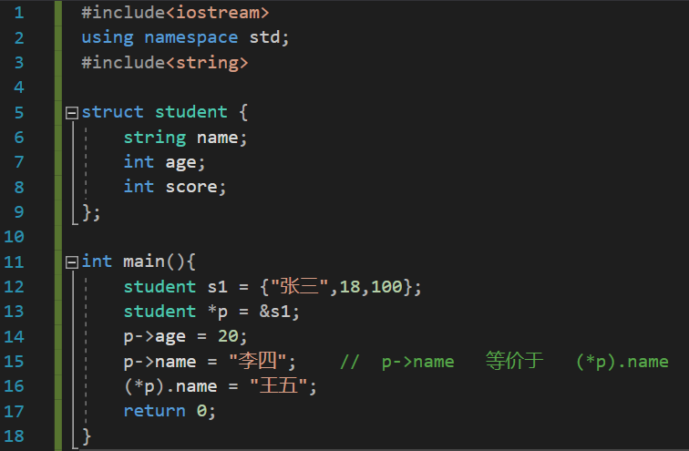

## 4.8 内存分区

### 4.8.1 代码区

- 存放函数体的二进制代码，由操作系统进行管理。

- 程序运行前：

  （1）存放CPU执行的机器指令；

  （2）代码区是**共享**的，共享的目的是对于频繁被执行的程序，只需要在内存中有一份代码即可；

  （3）代码区是**只读**的，防止被意外修改。

### 4.8.2 全局区

存放全局变量、静态变量和常量。

程序运行前：

（1）该区域的数据在程序结束后由操作系统释放；

（2）还包括了字符串常量和其他常量；

（3）DATA段是保存初始化了的非const，非0的全局变量，BSS指没有初始化的和初始化为0的全局变量。

- 各类变量地址比较：可以看出，除了局部数据外，其余数据地址距离较近。

  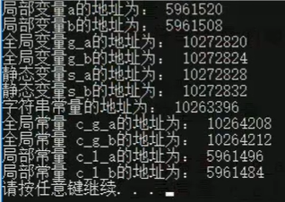

### 4.8.3 栈区

- 由编译器自动分配释放，存放函数的形参，局部变量等。
- 程序运行后：不要返回局部变量的地址（编译器可能会保留一次，用指针操作的时候，第一次可以调用，后续再调用就是非法调用了，因为已经被释放了）。

### 4.8.4 堆区

- ==由程序猿分配和释放==，若程序猿不释放，程序结束时由操作系统回收。

- 例如：int * p = new int (10); 指针本身也是局部变量，放在栈上，指针保存的数据是放在堆区的。

- new 返回的是==该数据类型的指针==。


# 五、嵌入式/硬件 等

## 5.1 线程和进程

-  **根本区别：**进程是操作系统资源分配的基本单位，而线程是处理器任务调度和执行的基本单位 。
-  **资源开销：**每个进程都有独立的代码和数据空间（程序上下文），程序之间的切换会有较大的开销；线程可以看做轻量级的进程，同一类线程共享代码和数据空间，每个线程都有自己独立的运行栈和程序计数器（PC），线程之间切换的开销小。 
-  **包含关系：**如果一个进程内有多个线程，则执行过程不是一条线的，而是多条线（线程）共同完成的；线程是进程的一部分，所以线程也被称为轻权进程或者轻量级进程。 

-  **内存分配：****同一进程的线程共享本进程的地址空间和资源，而进程之间的地址空间和资源是相互独立的 。

-  **影响关系：**一个进程崩溃后，在保护模式下不会对其他进程产生影响，但是一个线程崩溃整个进程都死掉。所以多进程要比多线程健壮。

-  **执行过程：**每个独立的进程有程序运行的入口、顺序执行序列和程序出口。但是线程不能独立执行，必须依存在应用程序中，由应用程序提供多个线程执行控制，两者均可并发执行。
-  **记忆方法：**想象一个工厂，进程代表一个个车间，线程代表每个车间里面的工人，工人可以在不同车间里走动（线程资源共享），每几个工人（线程）负责一个车间（进程）；一个工人出了问题，各个线程就都出现问题。
-  **死锁：**多个并发进程因争夺系统资源而产生互相等待的现象；有四个必要条件：互斥、占有且等待、不可抢占和循环等待；可以一次申请足够内存或者利用银行家算法预先分配好系统资源和内存来避免死锁现象。
- **进程间通信方式：**管道、FIFO、信号量、消息队列、 套接字Socket 和共享内存。

## 5.2 中断

- 不可以传参，无返回值。
- 中断区别于DMA：中断需要CPU参与，DMA没有。
- 中断服务函数：不可有阻塞操作，因为中断时是完全占用内核的，不存在调度。
- 中断是异步，**异常**是同步。

## 5.3 RTX操作系统

- RTX： Real - Time  eXtension，专门为ARM设计的操作系统。

- M3/M4/M7可以实现零中断延时，Keil自带的操作系统，无需移植；反映 RTOS 实时性的两个重要指标：一个是中断延迟时间，另一个是任务切换时间。

- RTX5的典型需求是5Kb的ROM空间。

- 在Keil中配置（RTE），选中CMSIS->CORE、RTOS2(API)->KEil RTX5和Device->Startup，即搭建好了运行RTX5的基本配置，如下图所示。

  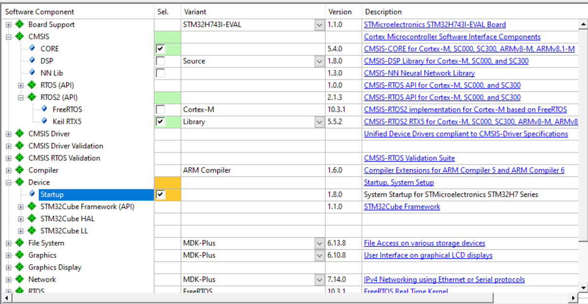

- 数量不限的任务数量，254级优先级。

- RTX支持时间片、抢占式和合作式调度。

- RTX系统常用函数：

  （1）osKernelInitialize() : 初始化内核；

  （2）osKernelStart() :启动RTOS；

  （3）osKernelGetTickCount(): 获取内核计数；

  （4）osDelay() : 延时函数；

  （5）osThreadSuspend()：任务挂起函数；

  （6）RTX_config.h : 可以配置、裁剪RTX系统，如OS_TICK_FREQ   1000 表示系统计数1000次时，运行1秒。

## 5.4 名词/常考

- 推挽输出：可输出高或低电平；开漏输出：只输出低电平。

- DC-DC效率大于LDO，DC-DC可以升降压，LDO只能降压。

- **RAM：**Random Access Memory，容量比ROM小，运行内存。

- **ROM：**Read - only  Memory，容量较大，断电信息不丢失。

- **FLASH：**闪存，可擦除，可编程，断电信息不丢失（U盘）。

- **DRAM：**动态RAM，断电信息丢失，功耗较大，慢，便宜。

- **SRAM：**静态RAM，断电信息丢失，低功耗，速度快，贵。

- **PROM：**可编程只读存储器，只能写一次。

- **EPROM：**可编程可擦除ROM。

- **GPS：**

  （1）定位至少需要四颗星：除了经纬高，还需要同步时间；

  （2）GPS的星历数据，有效期一般两小时；

  （3）伪距定位法。

- **PCB:**

  （1）走线宽度：1A   -------   40mil；

  （2）ctrl + m ：测量距离；

  （3）ctrl + g ：修改虽小移动间距；
  
  （4）英文大写模式下，shift + S  单层/多层显示，按 “ * ” 切换层；
  
- **SPI：**

​       （1）同步通信，全双工，4根线 SCK、CS、MOSI和MISO ；

​	   （2）常见的支持SPI的芯片：AD7606、UZ2400、AD9361；

​       （3）SPI有四种模式,mode0和mode3较为常见：

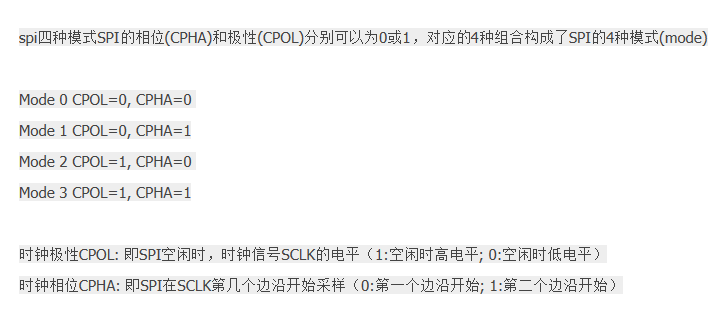

- **IIC：**

  （1）同步通信，半双工，2根线 SCL、SDA ；

  （2）常见的支持IIC的芯片： AT24C01A 存储芯片；

  （3）IIC传输速率可达几百kb，SPI可以几兆，IIC速率比SPI慢一些。

- UART：

  （1）异步通信，全双工；

  （2） USART：universal synchronous asynchronous receiver and transmitter  通用同步异步收发器；
             UART：universal asynchronous receiver and transmitter  通用异步收发器 ；

  （2）波特率计算：

  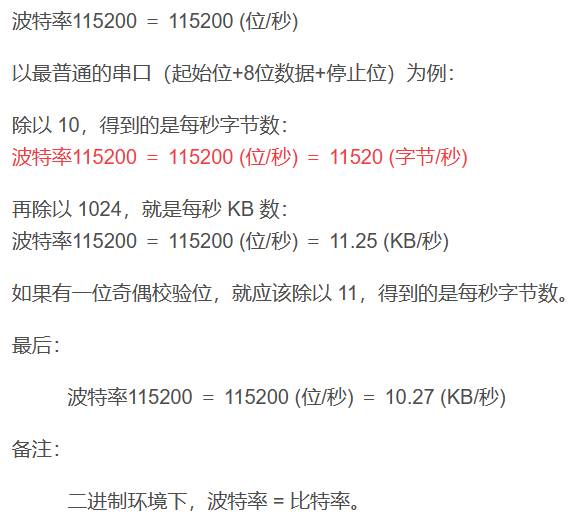

## 5.5 ARM相关

- **ARM-A：** 应用级，高性能。
- **ARM-R：** 实时性要求高，中断快。
- **ARM-M：**快速高确定性的中断管理，**低功耗**。
- ARM有37个32位寄存器，其中31个通用寄存器，6个状态寄存器。
- ARM的bin文件：不带地址的文件（烧写时需要用户指定地址）；hex文件是带地址的文件。
- ARM的Keil工程中，后缀为.map的文件，可以查看本项目代码占用的空间。

## 5.6 AD7606驱动

### 5.6.1 BSP概念

- BSP（board  support  package）是板级支持包，介于主板硬件和操作系统之间的一层，多用于ADC和串口，flash一般不用。BSP在嵌入式中的角色，类似BIOS在PC系统中的角色。==BSP是所有与硬件相关的代码体的结合==。

- BSP分为三部分：

  （1）系统上电时的硬件初始化；

  （2）为操作系统访问硬件驱动程序提供支持；

  （3）集成的硬件相关和硬件无关的操作系统所需的软件模块；通常找一个与自己mcu或项目相近的最小系统BSP（demo包），然后以此为基础进行修改。

  

### 5.6.2 AD7606配置

- AD7606特性：

  （1）逐次逼近型ADC，低功耗高精度，逐次逼近型的采样速率通常低于 5Msps（ < 每秒采5M个点）；

  （2）无需负电源，无需前端模拟运放电路，可直接接传感器输出；

  （3）5.0V, 耗电最大 50mA；最大 200KHz采样频率。

- AD7606原理图（带有自检）

  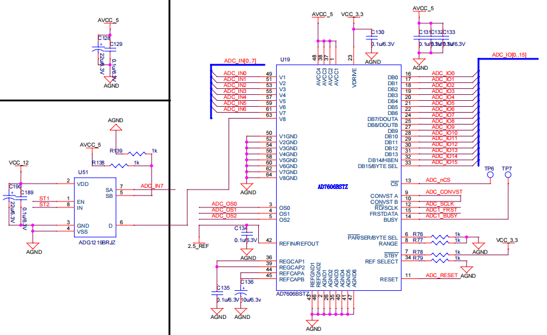

- IO口配置：

  （1）ADC_IN[0:7] :来自8个ADG1206的模拟信号；

  （2）ADC_IO[0:15] : 16位输出，连接至ARM；

  （3）ADC_OS[0:2] : 过采样控制，000时表示无过采样，若是64倍过采样，则表示每次采样，ADC会采样64次（插值）并取平均；

  （4）ADC_CONVST : A和B短接即可让8个通道同步采样，同时ARM给一个开始采样的信号；

  （5）ADC_RESET : 高电平复位，上电应该收到一个RESET脉冲，持续50ns，读取期间施加RESET脉冲的话，输出寄存器内容就会清零；转换期间施加RESET脉冲的话，转换会被中断；

  （6）ADC_BUSY : 转换开始后，BUSY拉高；

  （7）ADC_CS : 拉低后，使能输出总线ADC_IO[0:15]；

  （8）ADC_FRST : 数字输出，暂未用到；

  （9）RANGE：拉高表示输入范围±10V，拉低表示输入范围±5V。

- AD7606时序：

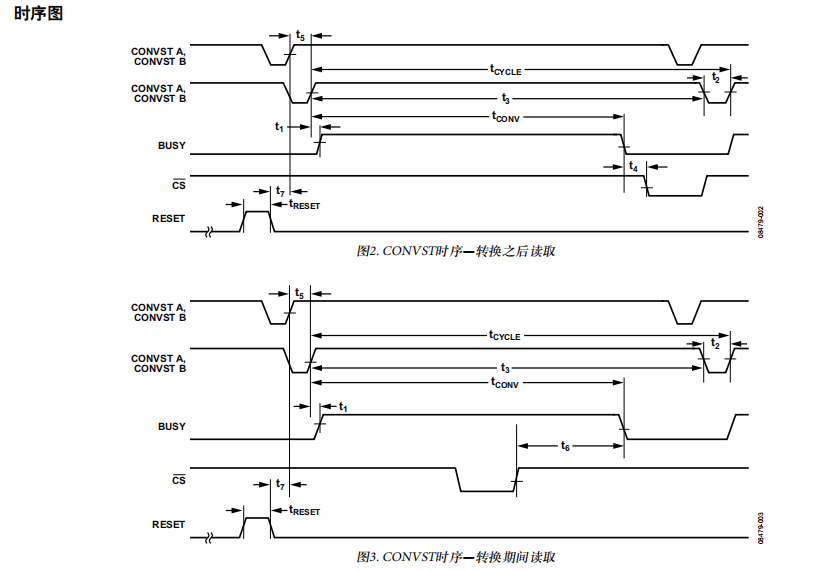

​		对于上图2，CONVST_A/B拉高后，开始同步采样，然后BUSY拉高表示正在转换，转换完成后BUSY拉低，然后CS拉低使能输出总线ADC_IO[0:15]。

- AD7606设置：

  顺序：main.c (main函数) ——> bsp.c  (bsp_Init函数) ——> bsp_ad7606.c (bsp_InitAD7606函数) 

  ——> SWITCH_ALL_ON打开八个接收通道、AD7606_SetOS设置过采样、AD7606_Reset复位；

- AD7606内部结构：

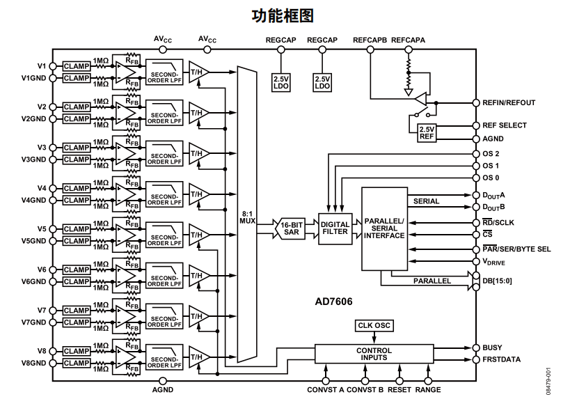

抗混叠滤波器：输入信号中，超过最高频率的其他频率，特别是与采样频率接近的频率，要通过抗混叠滤波器进行抑制，防止采样时出现频率混叠。


# 六、STL

## 6.1 STL组成

- STL：Standard Template Library  标准模板库。
- 六大组件：容器、算法、迭代器、仿函数、适配器和空间配置器。

## 6.2 vector容器

- 区别于数组，vector容器可以动态扩展。

- vector相关位置指向：

  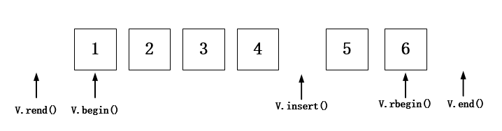

## 6.3 仿函数

- STL里面内建了一些函数对象，分为算术仿函数、关系仿函数和逻辑仿函数。
- 需要引入头文件  ： #inclulde< functional>

## 6.4 常用算法

### 6.4.1 排序  sort

- 升序：sort (   v.begin()  ,  v.end()   );
- 降序：sort (   v.begin()  ,  v.end()  ，greater< int>( )  );     需要头文件#include< functional>

### 6.4.2 遍历  for_each / transform

- for_each( 头，尾，函数/仿函数) ；                               //遍历容器
- transform(原头，原尾，新投，函数/仿函数) ;             //搬运容器到另一个容器中


# 七、C++文件操作

## 7.1 概述

- 需要包含头文件：< fstream>

- 文件类型分为两种：文本文件（ASCII码形式存在计算机中） 和 二进制文件（二进制形式存在计算机中，用户一般不能直接读取）

- 操作文件的三大类：

  （1）ofstream  :  写操作

  （2）ifstream  ：读操作

  （3）fstream  ： 读写操作

## 7.2 文本文件

### 7.2.1 写文件

- 步骤：

  （1）包含头文件    #include< fstream> ;

  （2）创建流对象   ofstream  ofs ;

  （3）打开文件  ofs.open("文件路径"  ,  "打开方式") ;

  （4）写数据   ofs<<"写入的数据";

  （5）关闭文件   ofs.close() ;

- 文件打开方式：

  （1）ios::in    为读文件而打开文件；

  （2）ios::out  为写文件而打开文件；

  （3）ios::ate  初始位置：文件尾；

  （4）ios::app  追加方式写文件；

  （5）ios::trunc  如果文件存在先删除，再创建；

  （6）ios::binary  二进制方式。

### 7.2.2 读文件

- 步骤：

  （1）包含头文件    #include< fstream> ;

  （2）创建流对象   ofstream  ifs ;

  （3）打开文件并判断是否成功打开   ifs.open(  "文件路径"  ,  "打开方式");

  （4）读取；

  （5）关闭文件   ifs.close() ;

- 读取方式：

  （1）    char  buf[1024]  =  {  0  };

  ​		  	while(   ifs  >  buf   ) {

  ​				cout<<  buf <<  endl;

  ​              }

  （2）  char  buf[1024]  =  {  0  };

  ​		  	while(     ifs.getline (buf , sizeof(buf)  )      )   {

  ​				cout<<  buf <<  endl;

  ​              }

# 八、Linux

## 8.1 组成

- 内核、shell、文件系统和应用程序 。 内核、shell和文件系统一起形成了基本的操作系统结构，它们使得用户可以运行程序、管理文件并使用系统。

  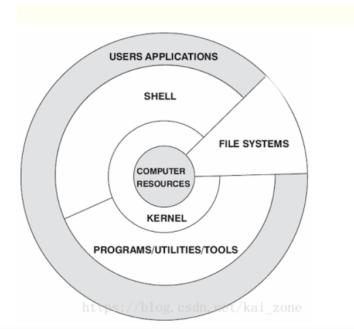

## 8.2 基本命令


## 8.3 目录操作命令


## 8.4 文件操作命令


